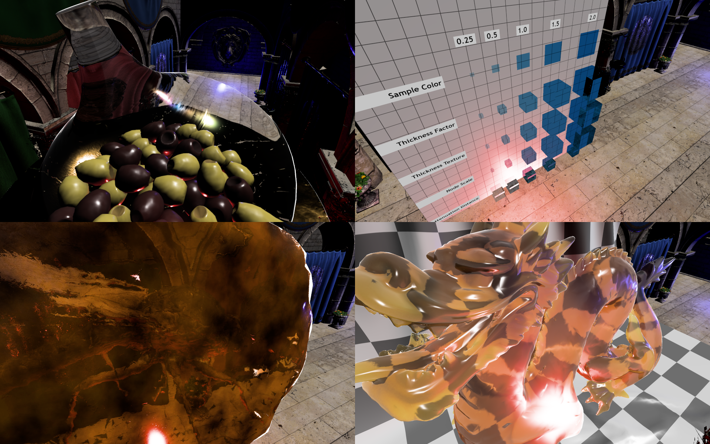

This is a high-performance renderer designed among other things to render glTF models that use the `KHR_materials_transmission` and `KHR_materials_volume` extensions.



It can:

* Handle rough transmissive materials such as frosted glass.
* Approximate refracted light through transmissive models that specify a thickness.
* Attenuate light via Beer's law.

It wasn't easy working out how to render these models. While the [glTF extension READMEs](https://github.com/KhronosGroup/glTF/tree/main/extensions/2.0/Khronos/KHR_materials_transmission) as fairly extensive, I had to look through the code of the [glTF-Sample-Viewer] to work out implementation details.

Transmissive materials that are totally smooth and do not have a volume can be rendered without any super special tricks [via pre-multiplied alpha and additive blending](https://stackoverflow.com/a/67047837/15390861). Transmissive materials with any kind of roughness or volume are quite a bit trickier.

The main trick I realised from reading over the code from the [glTF-Sample-Viewer] is that you need to render or blit all the rendered diffuse objects to a second framebuffer texture, which you then sample in a seperate pass for all the transmissive objects. If you want to handle rough transmissive objects then you need to generate a mip-chain for this sampled texture, as rougher objects need to fetch the transmitted light of the pixels behind them in a 'blurrier' way.

In my shader code, this is done via two functions (these I did mostly copy from the [gltf-Sample-Viewer]). The first, [`ibl_volume_refraction`](https://github.com/expenses/transmission-renderer/blob/0b06623e8c4e67b1cd44256cc050097dbfa169ab/glam-pbr/src/lib.rs#L290-L348) is only ran once per pixel. It handles fetching the transmitted light from the sampled framebuffer and attenuating it.

The second, the [`transmission_btdf`](https://github.com/expenses/transmission-renderer/blob/0b06623e8c4e67b1cd44256cc050097dbfa169ab/glam-pbr/src/lib.rs#L195-L231) is ran once per light and handles light that is scattered through the model and out onto the other side. This only effects materials that are a bit rough.

## Running

Clone https://github.com/KhronosGroup/glTF-Sample-Models into this directory as run with:

`cargo run -- <gltf-sample-model-name>`

```
transmission-renderer 0.1.0

USAGE:
    transmission-renderer [FLAGS] [OPTIONS] <gltf-sample-model-name>

FLAGS:
    -h, --help         Prints help information
        --log-leaks    Log allocator leaks on shutdown. Off by default because it makes panics hard to debug
    -V, --version      Prints version information

OPTIONS:
        --roughness-override <roughness-override>
            Override the default roughness factor of the model. Doesn't effect models that use a
texture for roughness

    -s, --scale <scale>                              A scale factor to be applied to the model [default: 1.0]

ARGS:
    <gltf-sample-model-name>    The name of the model inside the glTF-Sample-Models directory to
render
```

For some cool examples:

`cargo run -- DragonAttenuation --roughness-override 0.25`

`cargo run -- IridescentDishWithOlives --scale 5`

`cargo run -- MosquitoInAmber --scale 20`

`cargo run -- AttenuationTest --scale 0.1`

## Shader Compiling

I'm using my own project, [rust-gpu-cli-builder](https://github.com/expenses/rust-gpu-cli-builder) to build the shader module as I prefer this to using a build script. The arguments that I use to build it are:

`--target spirv-unknown-spv1.3 --capabilities RuntimeDescriptorArray --extensions SPV_EXT_descriptor_indexing`

## Other Fun Stuff

Oh, it also features

* Shader written entirely in [https://github.com/EmbarkStudios/rust-gpu](rust-gpu).
* Basic frustum culling via a compute shader and `vkCmdDrawIndexedIndirectCount`.
* A depth pre-pass setup where at max 2 full screens of fragments are processed (1 screen of opaque and 1 of transmissive objects on top).

[glTF-Sample-Viewer]: https://github.com/KhronosGroup/glTF-Sample-Viewer
